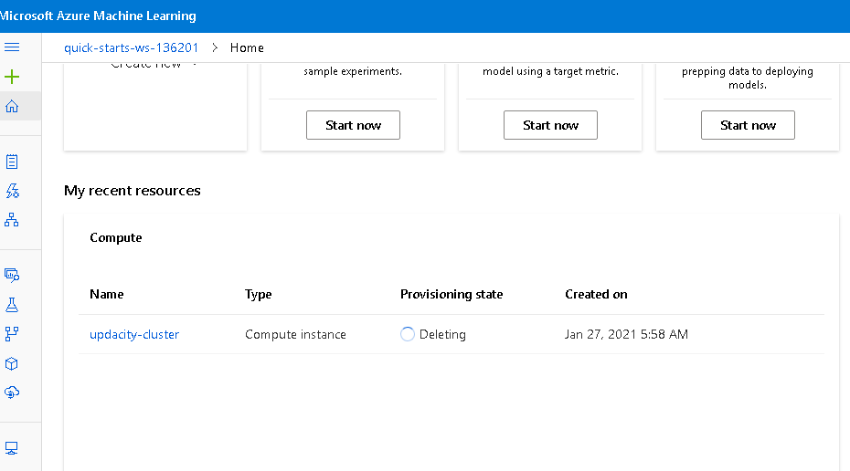

# Optimizing an ML Pipeline in Azure

## Overview
This project is part of the Udacity Azure ML Nanodegree.
In this project, we build and optimize an Azure ML pipeline using the Python SDK and a provided Scikit-learn model.
This model is then compared to an Azure AutoML run.

## Summary
The bank marketing's dataset contains 21 columns and 3300 rows. The data contains information on how many times a client was contacted during the campaign, job, loan, housing, and contact history on whether the client opted for a fixed loan rate deposit. The best performing model was VotingEnsemble with the accuracy of 0.9171 using AutoML. 

## Scikit-learn Pipeline
First, we created a worskpace and curated environment to initialize the compute cluster. Then, the dataset is tabular so it was imported using an URL in the train.py script and the data was split into training and test datasets. Next, the logistic regresion was the algorithm used to obtain the best run and it was used for training of the hyperparameter tunning C and max_iter. The C is the regularization while max_iter is the max number of iterations. 
In this example, the randomParameter sampling was used because it runs faster and it supports the early termination and low performance runs. Grid Parameter sampling could have been a good alternative as well, however, this could become time consuming if budget was not an issue for us. 
The banditPolicy was used for early termintion of the hyperdrive run so once it is done running, it save the respurced needed for evaluation. Once the best model was determined based on the hyperparameter, the model was saved.

**What are the benefits of the parameter sampler you chose?**
I utilized the random sampling because each sample has a change of being selected, in this case, it runs through all the different samples and selects the best one. Random Search sets up a grid of hyperparameter values and selects random combinations to train the model and score. This allows you to explicitly control the number of parameter combinations that are attempted.

**What are the benefits of the early stopping policy you chose?**
The banditPolicy is an early termination policy based on slack criteria. Bandit terminates runs where the primary metric is not within the specified slack factor/slack amount compared to the best performing run.

## AutoML
**In 1-2 sentences, describe the model and hyperparameters generated by AutoML.**
The autoML was configured as follow:
```automl_config = AutoMLConfig(
    compute_target = compute_target,
    experiment_timeout_minutes=15,
    task='classification',
    primary_metric='accuracy',
    training_data=ds,
    label_column_name='y',
    enable_onnx_compatible_models=True,
    n_cross_validations=2)
```
AutoML runs our training model and provides the best possible model out of all of them. In this case, voting ensemble provided an accuracy of 91.71% in the 30 minutes run. The voting ensemble model is a model that generates an output by combining predictions of other models and resulting an accurate prediction.This model predicts the output based on small models, the number of cross validation for this case is 4. We also selected inside the automl_config, the type of algorithm used which classification, training data, primary metric, compute target, label column which is what we are trying to predict. 

Parameters generated for Voting Ensemble model by autoML:
```
reg_lambda=0.6842105263157894
silent=True,
subsample=1,
subsample_for_bin=200000,
subsample_freq=0,
verbose=-10

## Pipeline comparison
**Compare the two models and their performance. What are the differences in accuracy? In architecture? If there was a difference, why do you think there was one?**
In the hyperdrive, we obtained an accuracy of 91.59% compared to autoML voting ensemble which is 91.71%. The autoMl took about 30 minutes to run 23 models whereas hyperdrive model was around 10 minutes to run 10. AutoMl provided the option of running multiple models to selected the best one but it depends the type of dataset you are trying to run when it comes to select the best option. For this case, autoML provided a more in depth analysis in selected the best option.

## Future work
**What are some areas of improvement for future experiments? Why might these improvements help the model?**
We could use find some ways to handle imabalanced data. We can use Re-sampling technique: this strategy we focus on balancing the classes in the training data before providing the data as input to the machine learning algorithm.
Over Sampling-> it increases the number of instances in the minority class by randomly replicating them in order to present a higher representation of the minority class in the sample. We can also use AUC_weighted which is more fit for imbalanced data instead of Accuracy.
The AUC is an estimate of the probability that a classifier will rank a randomly chosen positive instance higher than a randomly chosen negative instance. We can also use AUC_weighted which is more fit for imbalanced data instead of Accuracy.

## Proof of cluster clean up
**If you did not delete your compute cluster in the code, please complete this section. Otherwise, delete this section.**
**Image of cluster marked for deletion**


